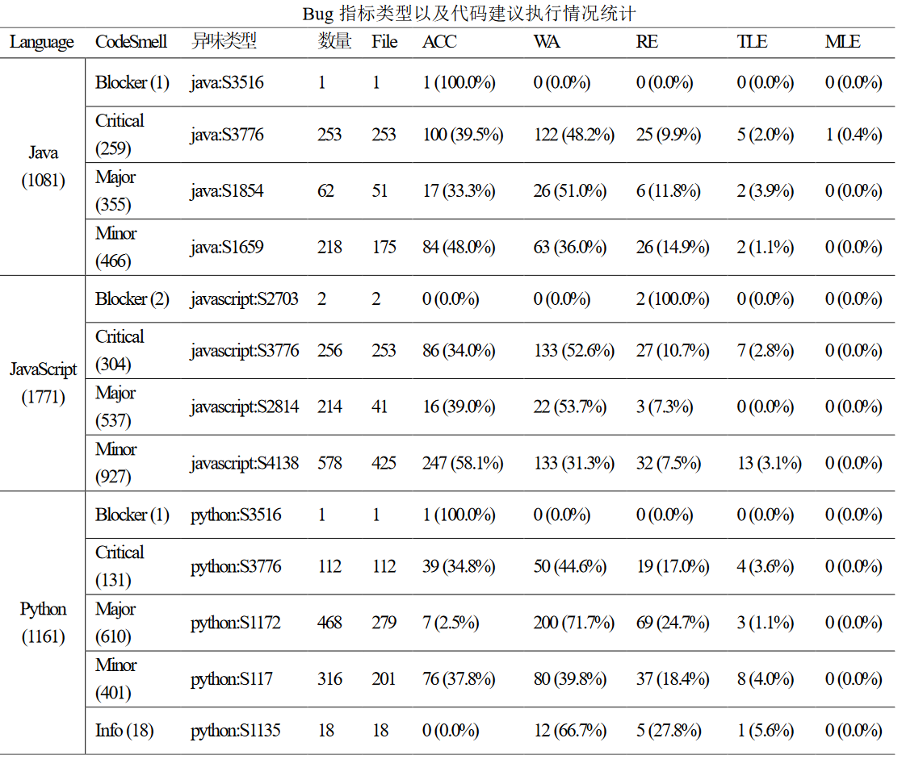
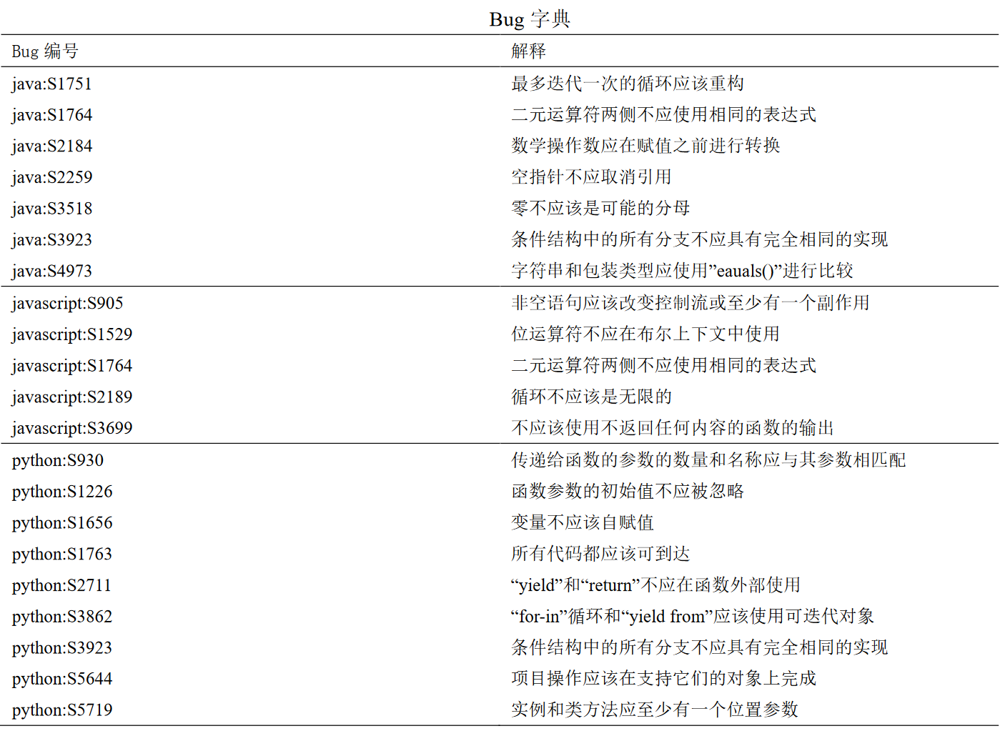
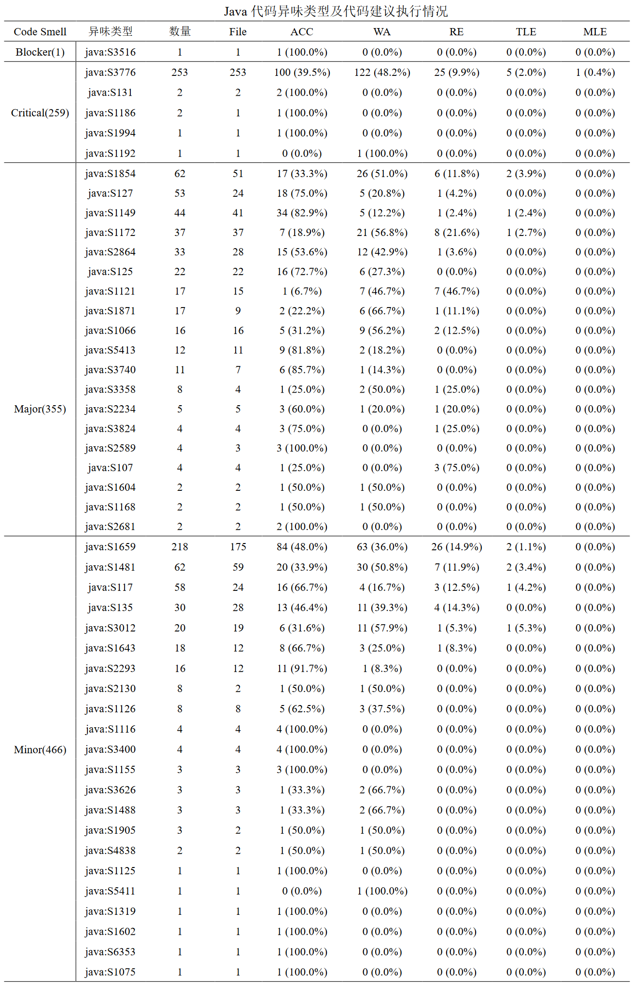
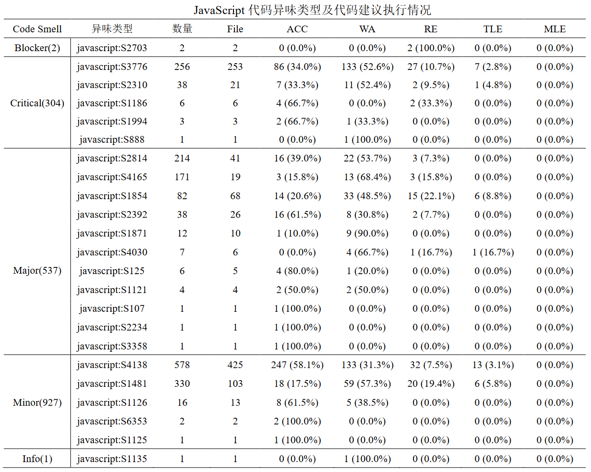
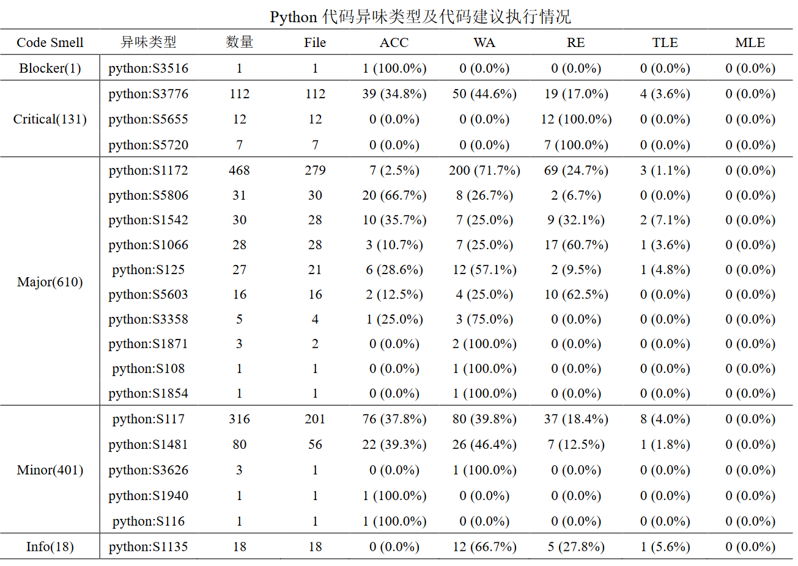
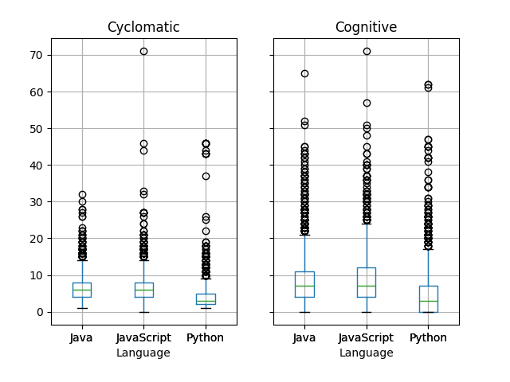
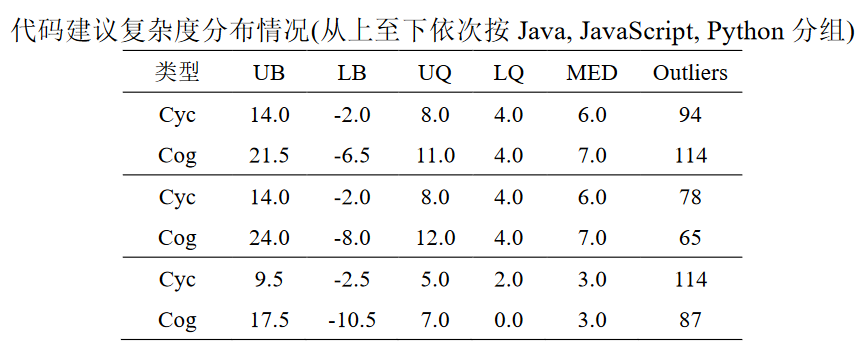
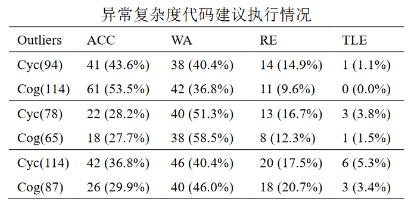

# Github Copilot代码质量分析

- [介绍](#1.介绍)
- [项目结构及解释](#2.项目结构及解释)
- [实验结果](#3.实验结果)
  - [Bug指标](#3.1 Bug指标)
  - [CodeSmell指标](#3.2 CodeSmell指标)
  - [复杂度指标](#3.3 复杂度指标)


## 1.介绍

我们希望通过大规模、高质量的文本数据作为Copilot输入获取不同语言的代码建议，以此来挖掘Copilot的代码质量特征。我们使用编写的脚本自动获取LeetCode所有的开源编程问题(共2033个)在三种主流编程语言(Java, JavaScript, Python)下的问题描述和函数模板并自动生成代码建议文件。接着我们使用Copilot对每个问题生成三种语言的代码建议，提交并记录LeetCode的执行结果。基于提交的代码建议，我们使用SonarQube(一个静态代码分析工具)来扫描Copilot生成的代码。我们希望结合代码建议的执行结果，对Github Copilot代码质量进行一个较为全面的分析。在我们的实验中，Java, JavaScript和Python的Bug数量分别为54，11，57，Bug类型的数量分别为7，5，9类。Java, JavaScript, Python的代码异味数量分别为1081， 1771， 1161，代码异味类型数量分别为47，23，20类。此外我们还收集了所有代码建议的圈复杂度值和认知复杂度值，并统计了它们的分布情况。

## 2.项目结构及解释

```powershell
├── figure                     
├── output                             
├── results
   ├── Complexity.xlsx
   ├── JavaMeasures.xlsx
   ├── JSMeasures.xlsx
   ├── PythonMeasures.xlsx
   └── TableSum.xlsx
├── ScanProject
├── AllData      
├── README.md         
└── record.xlsx       
```

- ***figure***  : 演示图片
- ***output*** : 所有的代码建议文件，按照语言和困难程度分类
- **results/**:   实验结果
- **results/Complexity.xlsx** :    三种语言代码建议的复杂度以及执行状态统计
- **results/JavaMeasures.xlsx:**   SonarQube扫描的Java代码建议的Bug以及CodeSmell指标及相应执行状态的统计结果。涵盖指标的评级以及具体指标原因和代码建议的执行结果。
- **results/JSMeasures.xlsx：**SonarQube扫描的JavaScript代码建议的Bug以及CodeSmell指标及相应执行状态的统计结果。
- **result/PythonMeasures.xlsx：**SonarQube扫描的Python代码建议的Bug以及CodeSmell指标及相应执行状态的统计结果。
- ***ScanProject：***参与SonarQube扫描的代码建议项目。    
- ***collector.py*** :   这个Python脚本用于爬取所有LeetCode问题链接中满足四种语言的(C, Java, JavaScript, Python)的所有问题，并将问题描述和四种语言下的函数模板存储至AllData.xlsx中，并在Output目录下自动生成代码建议。
- ***AllData.xlsx***: 存储脚本爬取的问题描述以及函数模板
- ***Links.xlsx：***所有的LeetCode问题链接。
- ***README.md***:   项目指南

## 3.实验结果

### 3.1 Bug指标

#### 3.1.1 Bug表现情况



#### 3.1.2 Bug字典



### 3.2 CodeSmell指标

#### 3.2.1 Java



#### 3.2.2 JavaScript



#### 3.2.3 Python



#### 3.2.4 CodeSmell字典

.png)

.png)

### 3.3. 复杂度指标






